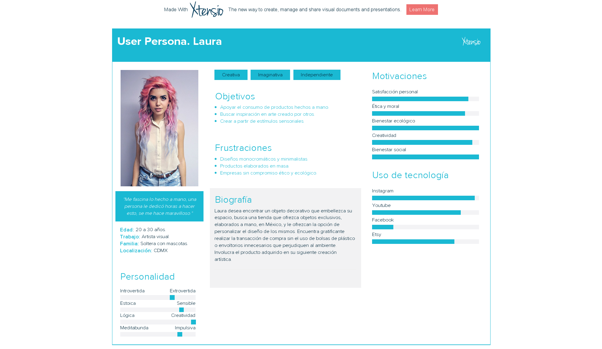
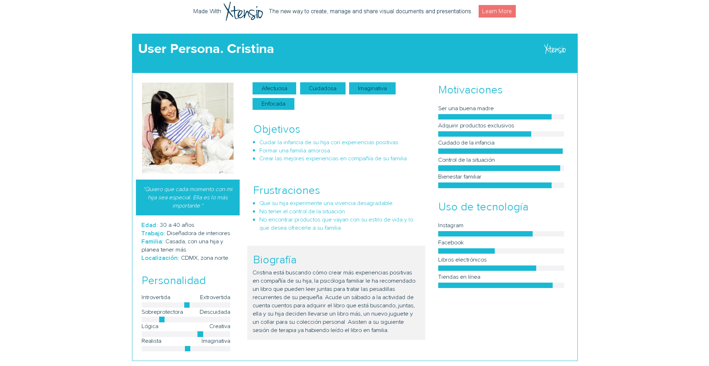
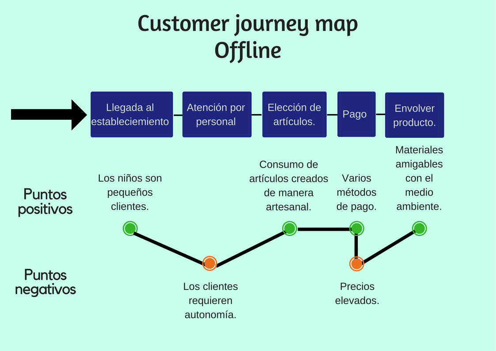
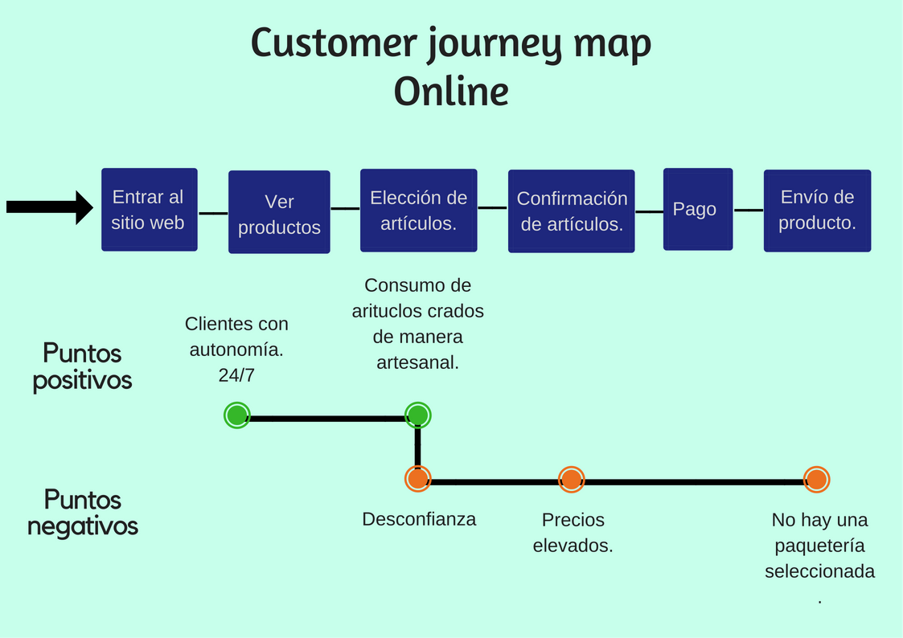

# Orion kids
Surge en Enero del año 2017 por tres mamás que son amigas, Gina, Guillermina y Marcela; ellas siempre se reunían para que sus hijos jugaran, fue así como les surge esta idea pues todas son lectoras y buscan involucrar a los pequeños al mundo del arte, es así como crearon este espacio, que está inspirado en el Cinturón de Orión la constelación más brillante. En donde ofrecen libros, juguetes, ropa, accesorios y mobiliario para niños de 0 a 7 años de edad, por si fuera poco, todos los fines de semana hay actividades culturales gratuitas para los niños.
## Objetivos de Orión Kids
•	Fomentar y difundir la lectura en los niños.
•	Disminuir el consumo de plástico.
•	Brindar un espacio en donde los niños pueden desenvolverse como pequeños clientes.
•	Ofrecer artículos mexicanos, hechos a mano.
•	Ofrecer un espacio de inclusión para los niños, a través de actividades.

## Objetivos de e-commerce
•   Brindar un espacio en donde los niños pueden desenvolverse como pequeños clientes.
•	Llegar a más clientes.
•	No perder clientes.
•	Tener un proceso de compra en línea más claro.
•	Eliminar ese proceso de compra manual, es decir con muchos pasos a seguir.

## Benchmark
Link a las tiendas existentes con temáticas similares.

**El sótano de los niños** 
[Talleres](https://www.elsotano.com/eventos.php)
[Tienda en linea](https://www.elsotano.com/ninos.php?page=1)

**Fify baby**
[Tienda en linea](https://www.fifibabyshop.com/)

**Macaria & Jacinta**
[Web](http://www.macariayjacinta.mx/)

## User Personas

## Customer journey map

## Anexos

[Audio, fotografías y transcripción de entrevistas](https://drive.google.com/drive/u/0/folders/1rsDWmlKbuUd0wZUUV8EEI8Cyw4Xqtn8p)